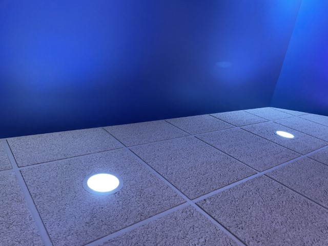
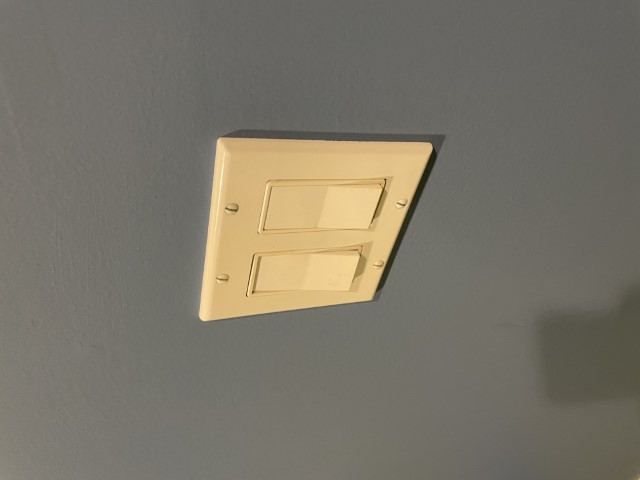
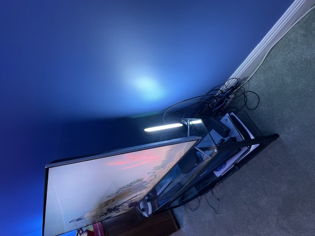
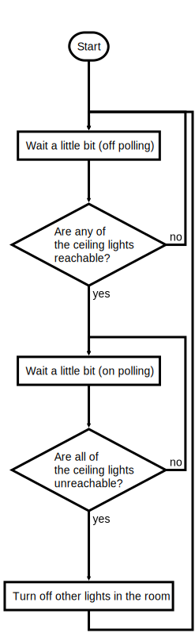

# Huegonaught

One of my personal Hack Week projects was to mess around with the [Hue](https://www.philips-hue.com/en-us) controller to help pimp out a game room with Hue lighting effects. This page will walk through the motivation and how I ended up building the thing.

## Motivation

We have a game room setup with a PS5 and some other game consoles ... ostensibly for the kids, but who are we kidding? I'm in there a whole bunch as well. I wanted to enhance it with some lighting effects, and since I'm already in the Hue ecosystem, I figured I'd look into using Hue lights to build it out.

I saw some cool examples of how you can sync the lighting to the picture on the TV (like [this](https://www.philips-hue.com/en-us/explore-hue/propositions/entertainment/sync-with-tv)), so how about something like that?

## Setting Up the Space

If I was building this around a PC gaming experience, it looks like I could use the [Hue Sync for PC](https://www.philips-hue.com/en-us/explore-hue/propositions/entertainment/sync-with-pc) application to sync the lights to what's going on the screen, but alas this is not a PC gaming room. Instead, I needed to acquire a [Play HDMI Sync Box](https://www.philips-hue.com/en-us/p/hue-play-hdmi-sync-box-/046677555221), which sits in between the PS5 and the TV and controls the color of any surrounding Hue lights based on what's on the screen. These devices seem to be in high demand, but I got lucky and found them in stock at [Best Buy](https://www.bestbuy.com/site/philips-hue-play-hdmi-sync-box-black/6371722.p?skuId=6371722). It's way more expensive than it should be, but let's face it: everything in the Hue ecosystem is more expensive than it should be.

The next step is to figure out the lighting to put around the screen. I have several can lights in the ceiling, and I already happened to have some BR30 color Hue bulbs, so I replaced the existing bulbs with the Hue bulbs.



These are all controlled by a dumb, non-dimming light switch on the wall, and -- spoiler alert! -- I didn't want to replace this switch. So you walk into the room, flip on the switch, all the ceiling lights turn on to bright white or whatever. You leave the room, you flip the switch off and they turn off (and become unreachable to the Hue hub).



All the cool photos that show the lighting synced with the TV show some lights behind the screen, so I'm going to need that. It seems like the only thing that's in more demand than the HDMI Sync Box is the [Play Gradient Lightstrip](https://www.philips-hue.com/en-us/p/hue-white-and-color-ambiance-play-gradient-lightstrip-75-inch/046677560423) that you're supposed to put behind your screen. I couldn't find that in stock anywhere, so instead I went with a couple of [Play Light Bars](https://www.philips-hue.com/en-us/p/hue-white-and-color-ambiance-play-light-bar-double-pack/7820230U7). They fit behind the screen and I pointed them at the wall. They actually work really well.



I also got a [Hue Bloom table lamp](https://www.philips-hue.com/en-us/p/hue-white-and-color-ambiance-bloom-table-lamp/046677560188) and put it off to the side for some more ambient lighting, but I'm not sure how much this really adds so I might find a different place in the house to put it. But for now, it's there.

Great! So now I've got all the lighting in place and the HDMI Sync Box installed. Next, you install an app called Hue Sync, which is distinct from the existing Hue app. Kinda thinking they could have consolidated the functionality, but I'm guessing this is [Conway's Law](https://en.wikipedia.org/wiki/Conway%27s_law) in the wild. I position all the lights, configure the room using the app (including the height of each of the lights, which is not obvious in the app), and try it out. It works and it's awesome! It's actually really cool and transforms the room. Even my 13-year old son says it's cool, so you **know** it's cool.


## The Challenge

We did it, right? End of story? Not quite. The problem comes when you're done gaming. Via the Hue Sync app, you can decide what you want to have happen to the lights when the HDMI input goes dark: you can turn all of the lights off, or you can have them all go to the “default” white. Since I don't want to be plunged into the dark when you've turned off the system, I have it set so that all the lights turn on to white when you're done gaming. Now you put everything away, and as you're walking out the door you hit the light switch, which turns off all the ceiling lights, but the *Light Bars and the Bloom Lamp stay on*.

So how can we turn off those other lights when we leave the room? I see a few options:
1. Use the Hue app to turn off the lights when you leave -- not very family-friendly.
1. Use the Amazon Echo to turn off the lights when you leave -- "Alexa, turn off the lights". Sure, but it's another step.
1. Use a motion sensor to turn off the lights -- I guess that's a possibility
1. Break down and replace the dumb switch with a smart switch -- but I don't want to
1. Hack! -- let's try this

## Hacking the Hue

So, the hack. If we can somehow sense when the ceiling lights are turned off (by becoming unreachable), then we can use the Hue API to send an "off" command to the other lights in the room. That doesn't seem too hard. And it turns out, it's not.

Enter Huegonaught. The horribly embarrassing name of the project comes from:
* **Hue** - works with Hue lights
* **Go** - written in Go
* **Naught** - turns lights off

I initially thought I'd need to model a full state machine for "On", "Off", and "Transition" to accommodate network blips, but really it's very simple. The entire flowchart looks like this:



Simple, straightforward, and inflexible ... just what I need. I thought I'd have to do all the API calls to the Hue bridge with `net/http`, but of course there's a library I can just link to called [gohue](https://github.com/Collinux/gohue), which is incomplete, but I have very simple needs here.

## Deployment

While fancy modern developers like to package up their apps in fancy Docker images to run on their fancy home Kubernetes cluster, I just keep buying Raspberry Pis and keep them relatively single-purpose. So yeah, I'm gonna run this on the Raspberry Pi that I use for little hacks like this. It was a piece of cake to cross-compile the binary for the Raspberry Pi using:
```
env GOOS=linux GOARCH=arm GOARM=5 go build
```
... and then `scp` it over. Try it out, and it works! Who needs tests?

I'm going to want to package this as a system service, but my knowledge of Linux services stops at `init.d`. So let's learn about `systemd`!

Huh. Well it turns out that systemd isn't so hard. I just need to create a service file like so:
```
pi@tinker:~ $ cat /etc/systemd/system/huegonaught.service
[Unit]
Description=Turns off game room Hue lights
After=network.target
StartLimitIntervalSec=0

[Service]
Type=simple
Restart=always
RestartSec=5
User=pi
WorkingDirectory=/home/pi
ExecStart=/bin/bash /home/pi/gameroom.sh

[Install]
WantedBy=multi-user.target
```
And then say the magic words:
```
sudo systemctl daemon-reload
sudo systemctl start huegonaught.service
sudo systemctl enable huegonaught.service
```
That wasn't so bad.

## Conclusion

Well, that's pretty much it. You could of course make this much more flexible, including doing actions when it detects when the dumb switch is turned on, or by using group names instead of referencing all the lights by their ids, but it's good enough for what I need.

Hack complete, mischief managed.
